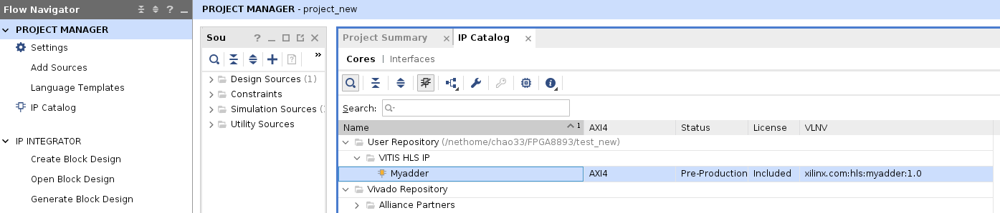

# Build a vector addition using Vitis HLS and Vivado

*Acknowledgment: this tutorial is written by Yihan Jiang and revised by Callie Hao at Georgia Tech ECE.*

## Preliminary
- Vitis HLS 2021.1
- Vivado 2021.1
- Xilinx Ultra96 V2 FPGA Evaluation Board

Note: Xilinx has a Y2K bug starting 2022 so please apply fixes first. Details can be found at [this Piazza post](https://piazza.com/class/kyaogfd8r1s2xl?cid=14)

## Environment Setup

Assume you have Vitis HLS and Vivado installed. Please execute the following commands, or add them to your bash file.
```sh
source /tools/software/xilinx/setup_env.sh
source /tools/software/xilinx/Vitis_HLS/2021.1/settings64.sh
alias vitis_hls="/tools/software/xilinx/Vitis_HLS/2021.1/bin/vitis_hls"
alias vivado="/tools/software/xilinx/Vivado/2021.1/bin/vivado"
```

## Design a simple adder using Vitis HLS

We first build a vector addition function using C++ in Vitis HLS. Later, we export the RTL (Verilog) design in Vivado to implement it on the board.

### Steps

1. Create a new project; specify the project name. It is not necessary to specify the top function nor the testbench now.

2. Select the correct `part` or `board` in the Part Selection during project initialization. 
	- For PYNQ-Z2, select part `xc7z020clg400-1` with 220 DSPs. **Note**: in lab 3, please use Pynq-Z2.
	- For Ultra96, select part `xczu3eg-sbva484-1-e` with 360 DSPs.

3. Now we can write our accelerator in c++ and simulate with Vitis. Create a new source file named `top.c` as the following:

```cpp
void top(int a[100], int b[100], int sum[100]) {
	#pragma HLS interface m_axi port=a depth=100 offset=slave bundle = A
	#pragma HLS interface m_axi port=b depth=100 offset=slave bundle = B
	#pragma HLS interface m_axi port=sum depth=100 offset=slave bundle = SUM
	#pragma HLS interface s_axilite register port=return
	for (int i = 0; i < 100; i++) {
		sum[i] = a[i] + b[i];
	}
}
```

4. Create a testbench named `main.c` as the following:
```cpp
#include <stdio.h>
void top( int a[100], int b[100], int sum[100]);
int main()
{
        int a[100];
        int b[100];
        int c[100];

        for(int i = 0; i < 100; i++) {
                a[i] = i; b[i] = i * 2; c[i] = 0;
        }

		// call the function, i.e., your adder
        top(a, b, c);

		// verify the results
        for(int j = 0; j < 100; j++) {
                printf("%d\n", c[j]);
        }
        return 0;
}
```

5. Go to `Project > Project Synthesis`, choose the `Synthesis` settings and specify the `top.c` as the top function. 

6. Go to `Project > Run C Simulation` to verify if the functionality of your adder is correct.

7. Go to `Solution > Run C Synthesis > Active Solution`, or click the synthesis icon (green triangle). After synthesis, you can read your performance (latency) report and resource utilization.

8. Finally, go to `Solution > Export RTL` to export the generated Verilog. Now we have done with Vitis and will switch to Vivado.

## Implement the adder on FPGA using Vivado

### Steps

1. Create a new project, name it as `adderProject`. Make sure you select the same board you're using. If you cannot find it, there is an `install board` icon at top right corner where you can install your own board.

2. Add our vector addition ip core to the Vivado. Click `IP Catalog` at the left column, right click the `Vivado Repository`, and select `Add Repository`.
Select the folder that includes your HLS solution. After click the `select` button, you will see a small page telling you that "1 repository was added to the project". Expand the IPs tab. If you see the top IP with an orange icon, it means no issue
for now. If the icon is grey, you might want to check whether you choose the
same board for Vitis and Vivado.





3. Now we build the block diagram. Click the `Create Block Design` at the left column. Click the `+` icon at the upper side of the diagram.
Type `hls` for finding the add function ip. Type `zynq 7 series` to find the embedded controller.

4. Since we specify two inputs and an output in our C code, we need to initialize three axi buses on the fpga. Double click the `zynq 7 series` icon
on the block diagram. Select `PS-PL Configuration`. Then, select the
`AXI HP0 FPD` to `AXI HP2 FPD` under `Slave Interface > AXI HP` by checking their boxes.


5. Go back to the block diagram and click the `Run Connection Automation`. Select the `All Automation` at the left column.
You need to manually map the HLS ports to the three AXI HP buses 1-to-1.
Click `OK` to start connection automation.
When it finishes, you will see a completed block diagram. To check its correctness,
click the `validation` (check icon) on the upper page. Below is the completed diagram. 


6. We finished building the block diagram, and now we will create a wrapper for it.
Find the block diagram file under the design sources. Right click the
design file (whatever you name it) and select `Create HDL Wrapper`.
Choose `Let Vivado manage wrapper and auto-update` option.
Click `OK` to start.

7. Finally, the last step. Click the `Generate Bitstream` under
`PROGRAM AND DEBUG` division (at the lower left of the entire page).
Use the default settings (for our simple example) and start to run.

8. After generating the bitstream file, we need two files for running the vector addition on FPGA: one with
`.bit` as the extension and the other with `.hwh`. You can find the `.bit` file under `adderProject/adderProject.runs/impl_1`. The `.hwh` file is under directory
`adderProject/adderProject.gen/sources_1/bd/design_1/hw_handoff`.
You can copy/paste these two files to a flash drive and put them on your own laptop for the next step.
Note that these two files must have the same name except for the extension.

## Deploy the adder to FPGA and control it using Python

1. If you have not used the Ultra96 or PYNQ before, check this page for [setup](https://pynq.readthedocs.io/en/v2.6.1/getting_started/pynq_z2_setup.html#).

2. If you already have a basic idea of Jupyter on these boards, upload the `.bit` file and the `.hwh` file to Jupyter. In the same folder, create a new `.ipynb` file for writing the script.

	- Click [here](https://pynq.readthedocs.io/en/v2.0/overlay_design_methodology/overlay_tutorial.html) to access the overlay tutorial.

3. Find the address offset of the memory ports (`a`, `b`, and `sum`, in this example). This information can be found in the xadd_hw.h file under `solution1/impl/misc/drivers/add_v1_0/src` direcoty, or `solution1/syn/verilog/add_control_s_axi.v`.

4. Below is the example Python host code to control the FPGA kernel.

```python
import numpy as np
import pynq
from pynq import MMIO

overlay = pynq.Overlay('adder.bit')

top_ip = overlay.top_0
top_ip.signature

a_buffer = pynq.allocate((100), np.int32)
b_buffer = pynq.allocate((100), np.int32)
sum_buffer = pynq.allocate((100), np.int32)

# initialize input
for i in range (0, 100):
    a_buffer[i] = i
    b_buffer[i] = i+5

aptr = a_buffer.physical_address
bptr = b_buffer.physical_address
sumptr = sum_buffer.physical_address

# specify the address
# These addresses can be found in the generated .v file: top_control_s_axi.v
top_ip.write(0x10, aptr)
top_ip.write(0x1c, bptr)
top_ip.write(0x28, sumptr)


# start the HLS kernel
top_ip.write(0x00, 1)
isready = top_ip.read(0x00)

while( isready == 1 ):
    isready = top_ip.read(0x00)

print("Array A:")
print(a_buffer[0:10])
print("\nArray B:")
print(b_buffer[0:10])

print("\nExpected Sum:")
print((a_buffer + b_buffer)[0:10])

print("\nFPGA returns:")
print(sum_buffer[0:10])
```
